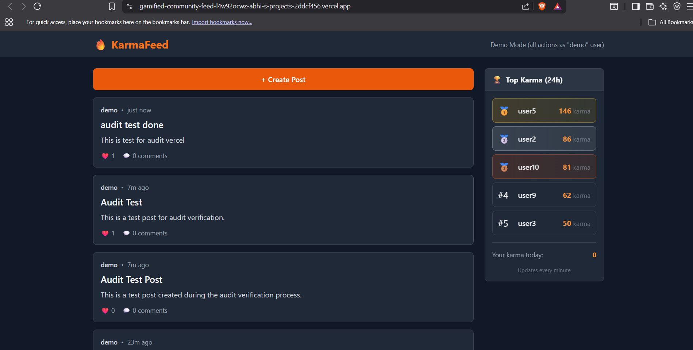
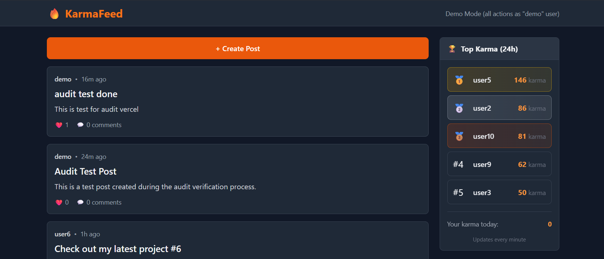
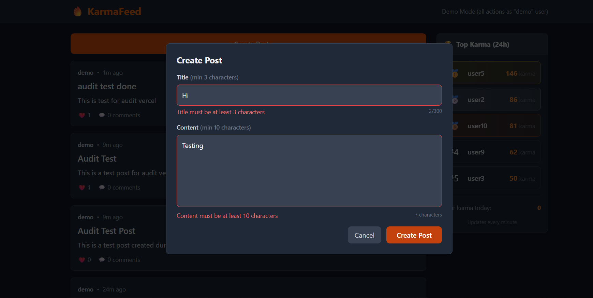

# KarmaFeed

A gamified community feed with nested threaded comments, like-based karma rewards, and a real-time leaderboard. Users can create posts, comment with unlimited nesting depth, like content to award karma, and compete on a 24-hour rolling leaderboard.

---

## 🌐 Live Demo

| Component | URL |
|-----------|-----|
| **Frontend** | https://gamified-community-feed.vercel.app |
| **Backend API** | https://karmafeed-backend.onrender.com/api/feed/ |
| **Leaderboard API** | https://karmafeed-backend.onrender.com/api/leaderboard/ |

> ⚠️ Backend is on Render free tier and may take ~30 seconds to wake up on first request.

---

## 🛠️ Tech Stack

**Backend:**
- Python 3.11 / Django 5.0 / Django REST Framework
- PostgreSQL 15
- Gunicorn (WSGI)
- Docker (multi-stage build)

**Frontend:**
- React 18
- Tailwind CSS

**Deployment:**
- Backend: Render (Docker)
- Database: Render Managed PostgreSQL
- Frontend: Vercel

---

## ✨ Core Features

- **Posts**: Create and view posts with author attribution
- **Nested Comments**: Reddit-style threaded comments (unlimited depth)
- **Likes**: Like posts (+5 karma to author) and comments (+1 karma to author)
- **Leaderboard**: Top 5 users by karma earned in last 24 hours
- **Delete**: Authors can delete their own posts and comments

---

## 🚀 How to Run Locally

### Backend (with Docker)

```bash
# Clone repository
git clone https://github.com/abhimh33/Gamified-Community-Feed.git
cd Gamified-Community-Feed

# Start backend + PostgreSQL with Docker Compose
docker-compose up --build

# Backend available at http://localhost:8000
# Database seeded with demo data automatically
```

### Backend (without Docker)

```bash
cd backend

# Create virtual environment
python -m venv venv
source venv/bin/activate  # Linux/Mac
.\venv\Scripts\Activate.ps1  # Windows

# Install dependencies
pip install -r requirements.txt

# Set up PostgreSQL and create database
# CREATE DATABASE karmafeed;

# Configure environment
cp .env.example .env  # Edit with your DB credentials

# Run migrations and seed data
python manage.py migrate
python manage.py seed_data

# Start server
python manage.py runserver
```

### Frontend

```bash
cd frontend

# Install dependencies
npm install

# Start development server
npm start

# Available at http://localhost:3000
```

---

## 🚢 Deployment Overview

### Backend (Render + Docker)

- **Dockerfile**: Multi-stage build with Python 3.11-slim
- **render.yaml**: Blueprint for automatic deployment
- **start.sh**: Runs migrations and seeds demo data on startup
- **Gunicorn**: 2 workers, 4 threads, gthread worker class

### Database (Render)

- Managed PostgreSQL 15
- Auto-provisioned via render.yaml blueprint
- Connection via `DATABASE_URL` environment variable

### Frontend (Vercel)

- Auto-deployed from `frontend/` directory
- Environment variable: `REACT_APP_API_URL` points to Render backend
- SPA routing configured via `vercel.json`

---

## � Documentation

- **[EXPLAINER.md](EXPLAINER.md)** - Technical deep-dive on architecture decisions

---

## 📸 Screenshots


*Main feed showing posts with like counts and karma*


*Post with nested threaded comments*


*Top 5 karma leaders in last 24 hours*


*Post creation modal with validation*

---

## � Future Features

- **User Authentication** — JWT-based login/signup with password reset
- **User Profiles** — Avatar, bio, karma history, and post/comment activity
- **Real-time Updates** — WebSocket integration for live likes and comments
- **Notifications** — Get notified when someone likes or replies to your content
- **Search & Filters** — Search posts by title, filter by date or popularity
- **Badges & Achievements** — Earn badges for milestones (first post, 100 karma, etc.)
- **Dark Mode** — Toggle between light and dark themes
- **Moderation Tools** — Report content, admin dashboard for managing posts/users
- **Email Digests** — Weekly summary of top posts and your karma earnings

---

## �📝 License

MIT License

Copyright (c) 2026 Abdulappa

Permission is hereby granted, free of charge, to any person obtaining a copy
of this software and associated documentation files (the "Software"), to deal
in the Software without restriction, including without limitation the rights
to use, copy, modify, merge, publish, distribute, sublicense, and/or sell
copies of the Software, and to permit persons to whom the Software is
furnished to do so, subject to the following conditions:

The above copyright notice and this permission notice shall be included in all
copies or substantial portions of the Software.

THE SOFTWARE IS PROVIDED "AS IS", WITHOUT WARRANTY OF ANY KIND, EXPRESS OR
IMPLIED, INCLUDING BUT NOT LIMITED TO THE WARRANTIES OF MERCHANTABILITY,
FITNESS FOR A PARTICULAR PURPOSE AND NONINFRINGEMENT. IN NO EVENT SHALL THE
AUTHORS OR COPYRIGHT HOLDERS BE LIABLE FOR ANY CLAIM, DAMAGES OR OTHER
LIABILITY, WHETHER IN AN ACTION OF CONTRACT, TORT OR OTHERWISE, ARISING FROM,
OUT OF OR IN CONNECTION WITH THE SOFTWARE OR THE USE OR OTHER DEALINGS IN THE
SOFTWARE.
